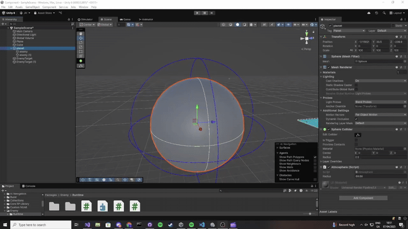

# Enemy System Guide

Here you will see how to use the Enemy system package

---

## Table of Contents
1. [Set-Up](#set-up)
2. [Enviorment](#enviorement)
3. [Enemy](#enemy)

---

## Set Up
You need to add this component to your Packages/manifest file

    "ie.setu.enemy": "https://github.com/itcOnlineGaming/-GA_25_P3_Joshua_Boyce_Hyland.git?path=/Enemy/Packages/ie.setu.enemy"

---

## Enviorment

### Overview

Here you can choose to create the enviorment the character will be walking on, with a choice of a sphere or some sort of plane : .

#### Use

##### Sphere enviorement set up

1. Add the `Atmosphere` script to your sphere world.
2. Adjust the radius to be bigger than the world. As an acutally atmosphere would.  

## Enemy

### Overview:

Here you can see how to create an enemy.

1. Attack an enemy script to an empty game object  
   
3. Assign the planet of the enemy scriipt
4. Give the Gameobject an animation Manager 
5. Assign this to the enemy Manager
6. Create a animation script which will implement an attack and a death function 
7. Assign these functions as animation events for your chosen animation.
8. Assigne these animattion in the default animation controller
9. Assign this controller to the animation manager.

