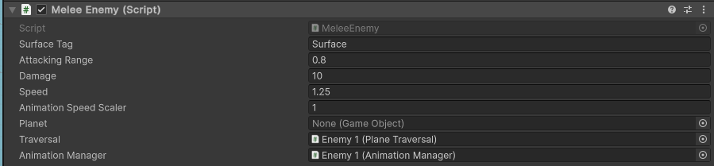

# Enemy System Guide

Welcome to the **Enemy System Package** guide. This document will help you get set up and walk you through the various components of the system.<br><br>
`find implemented in P2 at  https://github.com/itcOnlineGaming/Mole_Patrol/tree/enemy_component_use on the enemy_component_use branch`
---

## Table of Contents
1. [Set-Up](#set-up)
2. [Environment](#environment)
3. [Animation](#animation)
4. [Enemies](#enemies)
    - [Melee Enemy](#melee-enemy-setup)
    - [Ranged Enemy](#ranged-enemy-setup)
    - [Projectile](#projectile-setup)
5. [Enemy Targetable](#enemy-targetable)


---

## Set-Up

Add this component to your `Packages/manifest.json` file:

```json
"ie.setu.enemy": "https://github.com/itcOnlineGaming/-GA_25_P3_Joshua_Boyce_Hyland.git?path=/Enemy/Packages/ie.setu.enemy"
```

---

## Environment

### Overview

Choose the environment the character will walk on: either a **sphere** or a **plane**.

---

### Sphere Environment Setup

1. Add the `Atmosphere` script to your sphere world.
2. Adjust the radius to be **larger** than the world.
3. Assign the enemy's planet reference (in editor or programmatically).


---

### Plane Environment Setup

1. Add a **NavMesh** component to your chosen environment and **bake** it.
2. Tag the GameObject as `"Surface"`.


---

## Animation

### Setup

1. Create a custom animation script implementing **attack** and **death** functions using the enemy’s internal methods:

```csharp
public class AnimationScriptExample : MonoBehaviour
{
    public Enemy enemy;

    private void Start()
    {
        AnimationScriptExample example = enemy.animationManager.instantiatedModel.GetComponent<AnimationScriptExample>();

        if (example == null)
        {
            example = enemy.animationManager.instantiatedModel.AddComponent<AnimationScriptExample>();
            example.enabled = true;
            example.enemy = enemy;
        }
    }

    void attack()
    {
        enemy.attackTarget();
    }

    void death()
    {
        Destroy(enemy.gameObject);
    }
}
```

2. Assign these functions to **animation events** in your chosen animations.


3. Make a copy of the default controller at:  
   `"Packages/Enemy/Runtime/Animation/Default Controller"`  
   Assign your animations to the preset states.


4. Assign this controller to the **Animation Manager**. Your character is now fully animated.

---

### Animation Parameters


- **Model**: The model used for the enemy.
- **Capsule Offset**: Adjust the capsule's Y-axis offset.
- **Controller**: Use a copy of `default_animation` to plug in your own animations.

---

## Enemies

---

### Melee Enemy Setup

1. Add the `MeleeEnemy` script to an empty GameObject with an assigned **Animation Manager**.
2. Reference the Animation Manager in the script.
3. Attach your **Animation Event Script** to the object and link the **Enemy**.
4. Choose traversal type (Sphere or Plane). Attach the relevant script to the object and link it both ways with the enemy script.
5. Assign a surface tag, this is just to detect what the floor is, so if your surfaces dot have a tag assign one.



#### Melee Enemy Parameters
- **Surface Tag**: Tag name of your surface being traversed.
- **Attack Range**: Distance to stop and attack.
- **Damage**: Attack damage.
- **Speed**: Movement speed.
- **Health**: Enemy health.
- **Animation Speed Scaler**: Float scaling animation speed based on movement speed.

---

### Ranged Enemy Setup


1. Repeat steps 1–5 from **Melee Enemy Setup**.
2. Set a larger **attack range**, e.g. `5`, for ranged attacks.
3. Add an empty GameObject to your model named `ShootingPoint`—this is the projectile spawn location.
4. Assign your projectile GameObject to the **Projectile** field.

---

### Projectile Setup

1. Assign the `Projectile` script to your projectile model.
2. Add a **collider** and **rigidbody**.
3. Specify whether the projectile should launch with an **Arc** or **Straight**.


- **Projectile Type**: projectile Launches in an **Arc** or **Straight** line.
- **Speed**: Speed of projectile.
- **Arc Height**: Max Height of the **Arc**.
- **Damage**: Damage done to **EnemyTargetable** gameobjects .
---

## Enemy Targetable
1. Create a derived class from `EnemyTargetable` that looks like the below:
   
```csharp
public class ExampleEnemy : EnemyTargetable
{

    

    public override void TakeDamage(float t_damage)
    {
        health -= t_damage; ;
    }

    private void Update()
    {
        if( health <= 0)
        {
            Destroy(gameObject);
        }
    }
}
```

2. Attach the derived script to a GameObject.
3. Set the variables to make the object targetable:
   - **Health**: Characters current health.
   - **Attackable**: Whether the target is currently attackable.


