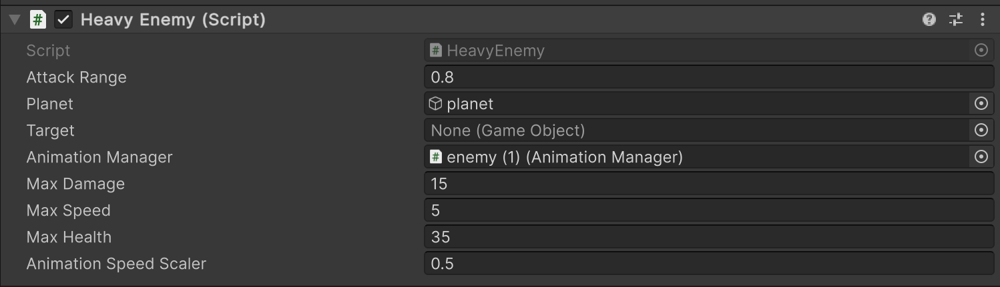
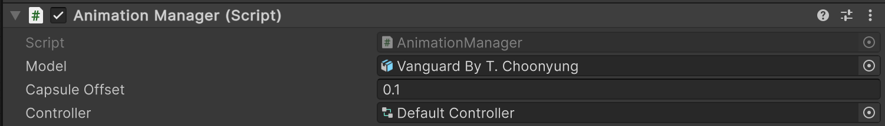

# Enemy System Guide

Here you will see how to use the Enemy system package

---

## Table of Contents
1. [Set-Up](#set-up)
2. [Enviorment](#enviorement)
3. [Enemy](#enemy)
4. [Enemy Targetable](#enemy-targetable)
5. [Customization](#customization)


---

## Set Up:
You need to add this component to your Packages/manifest file

    "ie.setu.enemy": "https://github.com/itcOnlineGaming/-GA_25_P3_Joshua_Boyce_Hyland.git?path=/Enemy/Packages/ie.setu.enemy"

---

## Enviorment

### Overview:

Here you can choose to create the enviorment the character will be walking on, with a choice of a sphere or some sort of plane : .


### Sphere enviorement set up:

1. Add the `Atmosphere` script to your sphere world.
2. Adjust the radius to be bigger than the world. <br>

3. Assign the enemys planet reference upon creation either through editor or programatically
4. Give the gameobject the tag "Surface"

### Plane enviorement set up:
1. Add a nav mesh component to your chosen enviorement and bake it.
2. Give the gameobject the tag "Surface"

## Enemy

### Scripts:
1. Create an empty Game object and attack a Enemy script to it <br>
2. Assign the Enemy the planet it will be traversing <br>
3. Give the enemy gameobject an animation Manager <br>
4. assign the enemys animation manager

### Animation:
1. Create a animation script which will implement an attack and a death function using the enemies relative functions<br>

<pre> ```cshar public class AnimationScriptExample : MonoBehaviour
{
    // Start is called once before the first execution of Update after the MonoBehaviour is created


    public Enemy enemy;


    private void Start()
    {
        
        AnimationScriptExample example = enemy.animationManager.instantiatedModel.AddComponent<AnimationScriptExample>();

        example.enabled = true;
        example.enemy = enemy;  
    }
    void attack()
    {
        enemy.attackTarget();
    }


    void death()
    {
        Destroy(enemy.gameObject);
 }}``` </pre>

2. Assign these functions to animations events in your choosen animations  <br>


3. Make a copy of the default controller at "Packages/Enemey/Runtime/Animation/ Default Controller" assign the animations<br>

8. Assign this controller to the animation manager and yoru character is fully animated .<br>

## Enemy Targetable

1. Attach Script and set variable to make the object targetable by the enemy.
2. Set Health and whether the target is currently attackable.


## Customization

### Enemey Scripts:
- **Attack Range:** Customize the attack range of the enemy, the distance an enemy will attack enemies.
- **Max Damage:** Attack damage of the enemy.
- **Max Speed:** Movement speed of enemy.
- **Max Health:** Health of enemy.
- **Animation Speed Scaler** float which scales the speed of the animation relative to the **Max Speed**.


### Animation
- **Model**: The model which will be used for the enemy.
- **Capsule Offset**: Offsets the capsule on y axis if adjustment needs to be made.
- **Controller**: Use copy of default_animation controller to use your own animations with your own custom events.



